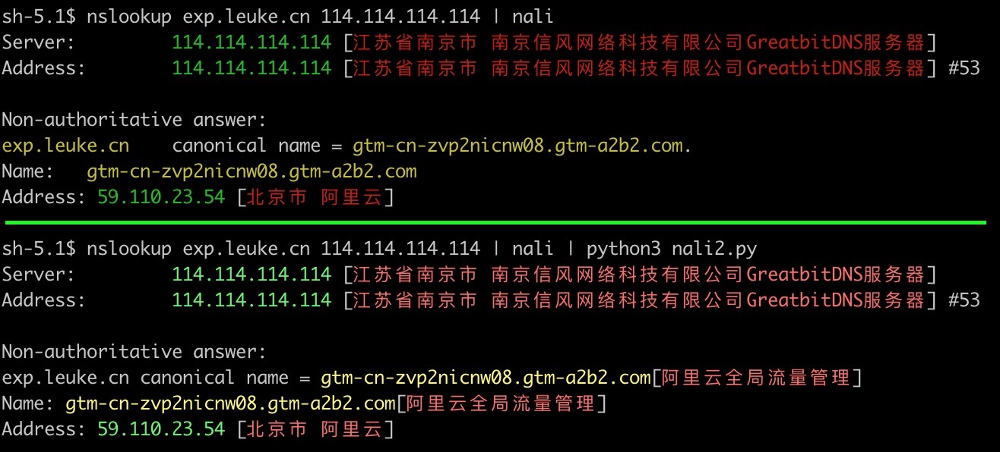

[https://github.com/zu1k/nali](https://github.com/zu1k/nali) 的 CDN 信息不支持正则，用 `nali2.py` 对 `nali` 结果二次处理，补充需要用正则的 CDN 信息。

## 使用方法
1. 下载 cdn.yml 和 nalil2.py

```bash
wget https://raw.githubusercontent.com/4ft35t/cdn/master/src/cdn.yml -O ~/.nali/cdn.yml
wget https://raw.githubusercontent.com/4ft35t/cdn/master/nali2.py
```

2. pip 安装 publicsuffixlist 库
```bash
pip3 install publicsuffixlist
```

3. 用 nali2.py 补全信息
```bash
nslookup exp.leuke.cn 114.114.114.114 | nali | python3 nali2.py
```

## 和 nali 对比

